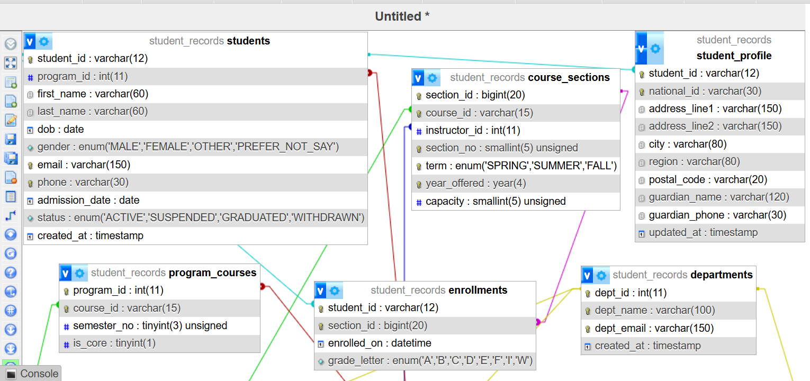
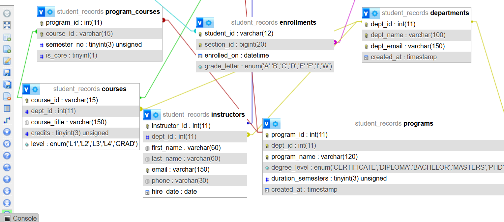

# 🎓 Student Records Database Management System

## 📌 Project Title
**Student Records Database Management System**

## 📖 Description
This project is a **Student Records Database Management System** built using **MySQL**.  
It manages student information, courses, and enrollments in a structured way, ensuring data integrity and minimizing redundancy.  

The system demonstrates:
- ✅ Database Normalization (1NF, 2NF, 3NF)  
- ✅ Use of Primary & Foreign Keys  
- ✅ Relationships (1-1, 1-M, M-M where needed)  

It can be extended for real-world use in **schools, universities, or training institutions**.

---

## ⚙️ Setup Instructions
1. Install **MySQL Server** on your computer.  
2. Open **MySQL Workbench** or any SQL editor.  
3. Import the SQL schema file provided (`student_records.sql`) by running:  
   ```sql
   source path/to/student_records.sql;

## 🗂️ ERD Diagram

Below is the Entity-Relationship Diagram (ERD) for the Student Records Database:



